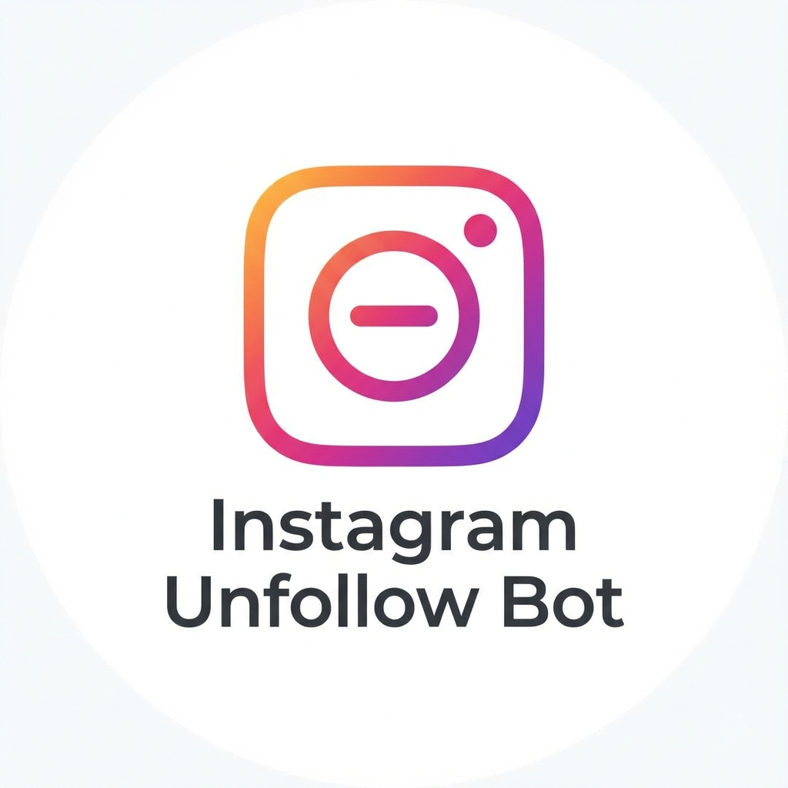
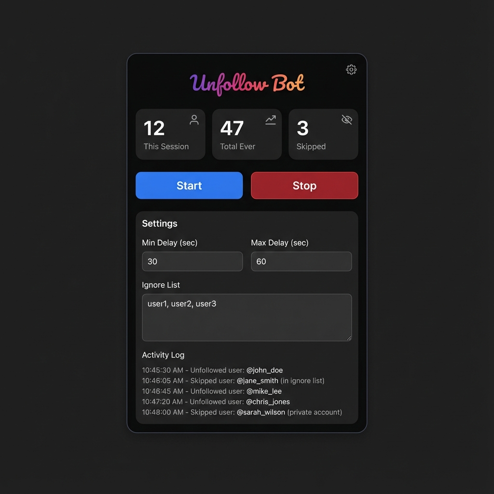

<p align="center">
  
</p>

# Instagram Unfollow Bot

A Chrome extension to bulk unfollow accounts on Instagram with safety features, ignore lists, and human-like timing.




## Disclaimer

**Use at your own risk.** This tool automates actions on Instagram, which may violate their Terms of Service. Instagram may:
- Temporarily restrict your account
- Rate-limit your actions
- In extreme cases, suspend your account

**The authors are not responsible for any consequences of using this tool.**

## Features

- **Bulk unfollow** with one click
- **Safety features** - Random delays (30-90s), session limits
- **Ignore list** - Protect accounts you want to keep following
- **Dry run mode** - Test without actually unfollowing
- **Activity log** - Track unfollows and skipped accounts
- **Configurable** - Custom delays, limits, auto-scroll
- **Persistent storage** - Settings and stats saved across sessions

## Installation

1. Download or clone this repository
2. Open Chrome and go to `chrome://extensions`
3. Enable **Developer mode** (top-right toggle)
4. Click **Load unpacked**
5. Select the extension folder

## Usage

1. Navigate to `instagram.com/[your-username]/following`
2. Click the extension icon to open the popup
3. (Optional) Add usernames to the ignore list
4. (Optional) Enable **Dry Run** to test first
5. Click **Start**

### Settings

| Setting | Default | Description |
|---------|---------|-------------|
| Min Delay | 30s | Minimum wait between unfollows |
| Max Delay | 90s | Maximum wait between unfollows |
| Max Unfollows | 50 | Auto-stop after this many |
| Dry Run | Off | Test mode - doesn't actually unfollow |
| Auto-scroll | On | Scroll to load more users |

### Ignore List

Add usernames (one per line) to skip during unfollowing:
```
friend1
family_member
favorite_brand
```

## Safety Recommendations

- **Start slow**: Use dry run mode first
- **Conservative limits**: Stick to 50-100 unfollows per day
- **Take breaks**: Wait a few hours between sessions
- **Monitor**: Watch for any warning messages from Instagram

## File Structure

```
insta-unfollowbot/
├── manifest.json      # Chrome extension config
├── popup.html         # Extension popup UI
├── popup.css          # Popup styles (dark theme)
├── popup.js           # Popup logic
├── content.js         # Instagram automation
├── background.js      # Service worker
├── icons/             # Extension icons
├── LICENSE            # MIT License
└── README.md          # This file
```

## Contributing

Contributions are welcome! Please feel free to submit a Pull Request.

## License

MIT License - see [LICENSE](LICENSE) file for details.

---

**Remember**: Use responsibly and respect Instagram's community guidelines.
